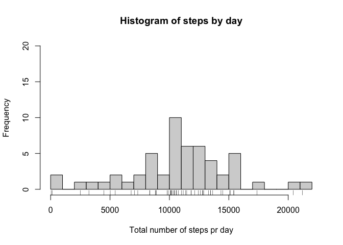
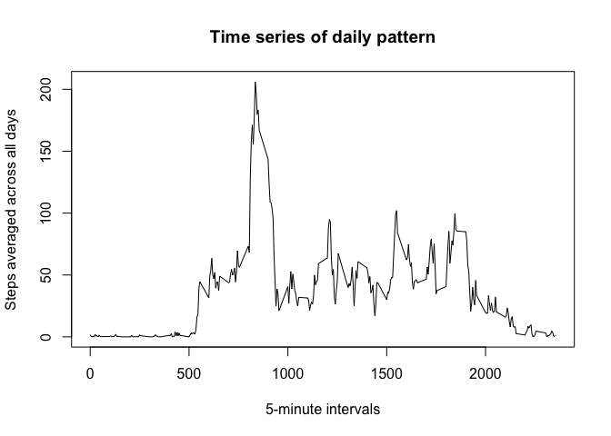
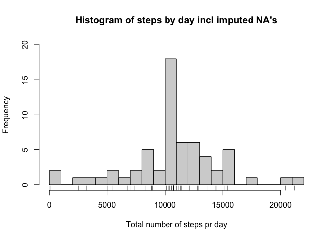
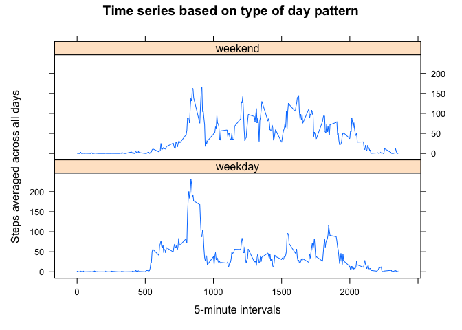

---
output:
  html_document:
    keep_md: true
---
# Assignment week2

*This is to complete week2 of the Reproducible Research course, at the Data Science Specialization*

#### Libraries I like to have with me

```r
library(tidyr)
library(dplyr)
library(timetk)
library(lubridate)
library(stringr)
library(data.table)
library(tibble)
library(slider)
library(lattice) 
library(ggplot2) 
library(graphics)  
library(grDevices) 
library(grid) 
```

### Code to read in and process the data  
*(change column date from character to date format)*

```r
x <- read.csv("activity.csv")
x$date = as.Date(x$date)
```

### Overview over the different datasets:
- x = original for the assignment
- y = sum steps pr date
- z = mean steps pr interval
- a = like x but additionally includes column with mean steps pr interval
*(a then impute NA in original steps column with this mean value)*
- x_nona = like x but with NA steps imputed from a
- b = sum steps pr date based on x_nona
- xx = x_nona arranged by date in ascending order (ocd!)
- xxx = xx with additional column stating the type of day pr date
*(xxx then converts every weekday to weekday and sat/sun to weekend in a factor format)*
- x_final = takes the mean steps pr interval separated by weekday/weekend

## What is mean total number of steps taken per day?

#### Calculate the total number of steps taken per day:

```r
sum(x$steps, na.rm = T)
```

```
## [1] 570608
```

#### Make a histogram of the total number of steps taken each day:  
*(using rug for fun and ylim to later compare when imputing NA's)*

```r
y <- aggregate(steps ~ date, x, FUN = sum, na.exclude = T)
hist(y$steps, main = "Histogram of steps by day", xlab = "Total number of steps pr day", breaks = 20, ylim = c(0, 20))
rug(y$steps)
```

<!-- -->

#### Calculate and report the mean and median of the total number of steps taken per day:

```r
mean(y$steps, na.rm = T)
```

```
## [1] 10767.19
```

```r
median(y$steps, na.rm = T)
```

```
## [1] 10766
```

So the mean number of steps taken pr day is 10.767 and the median 10.766

## What is the average daily activity pattern?

#### Time series plot of the average number of steps taken pr day

```r
z <- aggregate(steps ~ interval, x, FUN = mean)
plot(z$interval, z$steps, type = "l",
     main = "Time series of daily pattern",
     ylab = "Steps averaged across all days",
     xlab = "5-minute intervals",
     )
```

<!-- -->

#### Interval with max steps


```r
filter(z, steps == max(steps))
```

```
##   interval    steps
## 1      835 206.1698
```

## Imputing missing values

#### Count/check column for NA

```r
sum(is.na(x$steps))
```

```
## [1] 2304
```

```r
any(is.na(x$date))
```

```
## [1] FALSE
```

```r
any(is.na(x$interval))
```

```
## [1] FALSE
```

## Strategy to fill in NA's 

..are using the total average steps pr interval
*(I also researched using nafill/setnafill but failed to use it)*

#### Preparing averaged numbers


```r
a <- merge(x = x, y = z, by = "interval")
```

#### Replacing NA's with averaged interval value , cleaning up and check


```r
a$steps <- ifelse(is.na(a$steps.x), a$steps.y, a$steps.x)
x_nona <- select(a, steps, date, interval)
any(is.na(x_nona$steps))
```

```
## [1] FALSE
```

```r
any(is.na(x_nona$date))
```

```
## [1] FALSE
```

```r
any(is.na(x_nona$interval))
```

```
## [1] FALSE
```

#### Histogram including imputed NA's 


```r
b <- aggregate(steps ~ date, x_nona, FUN = sum)
hist(b$steps, main = "Histogram of steps by day incl imputed NA's", xlab = "Total number of steps pr day", breaks = 20, ylim = c(0, 20))
rug(b$steps)
```

<!-- -->

#### ..and numbers

```r
# mean pr day ->
mean(b$steps)
```

```
## [1] 10766.19
```

```r
# median pr day ->
median(b$steps)
```

```
## [1] 10766.19
```

```r
# sum total steps ->
sum(b$steps)
```

```
## [1] 656737.5
```

- yes, the values in the dataset with the imputed NA's differ a bit compared to the one where we ignored the NA's
- especially around the mean interval with 10.000 - 11.000 steps where the frequency rises from 10 to 18
- the total number of steps increases with approx 86.000
*(from 571' to 657')*

## Differences in activity pattern during weekend/weekdays

- create dataset based on imputed NA's
- add a column showing the actual weekday of the date
- replace man,tue,wed,thu,fri with weekday and sat,sun with weekend
*(failed to make the code smoother)*
- convert that column to factor

```r
xx <- x_nona %>% arrange(date)
xxx <- mutate(xx, typeofday = weekdays(xx$date, abbreviate = T))
xxx$typeofday[xxx$typeofday == "Sat"] <- "weekend"
xxx$typeofday[xxx$typeofday == "Sun"] <- "weekend"
xxx$typeofday[xxx$typeofday == "Mon"] <- "weekday"
xxx$typeofday[xxx$typeofday == "Tue"] <- "weekday"
xxx$typeofday[xxx$typeofday == "Wed"] <- "weekday"
xxx$typeofday[xxx$typeofday == "Thu"] <- "weekday"
xxx$typeofday[xxx$typeofday == "Fri"] <- "weekday"
xxx$typeofday <- as.factor(xxx$typeofday)
```

## Panel plot containing time series


```r
x_final <- aggregate(steps ~ interval + typeofday, data = xxx, FUN = mean)
xyplot(steps ~ interval | typeofday, data = x_final, type = "l", layout = c(1,2),
       main = "Time series based on type of day pattern",
       ylab = "Steps averaged across all days",
       xlab = "5-minute intervals",
       )
```

<!-- -->

- in the weekend we can see more steps during the later daytime
- in the weekdays there are more steps during the morning hours
